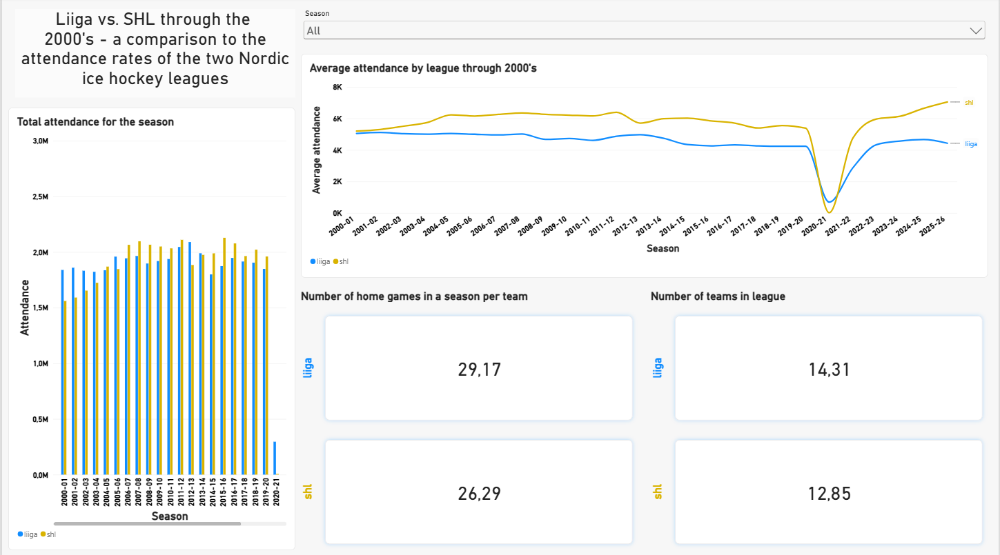
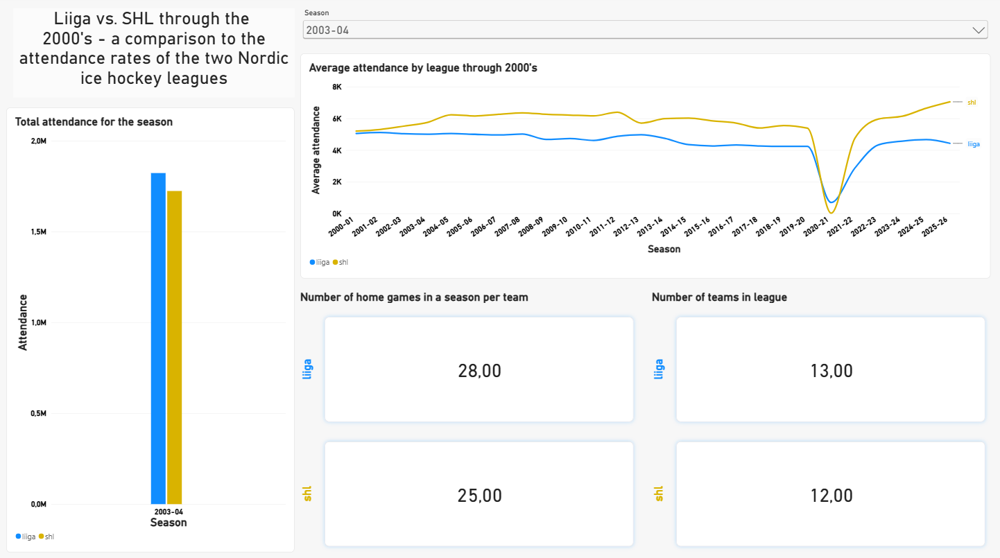
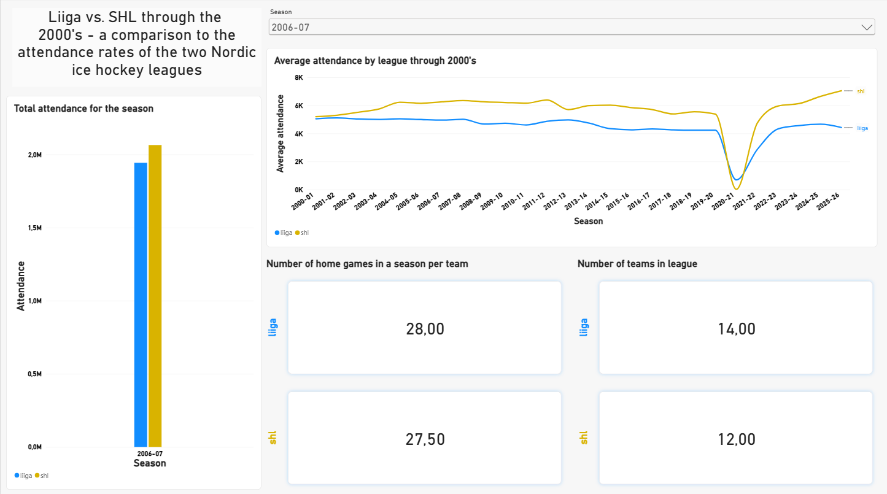

# Liiga vs. SHL: Attendance Trend Analysis — Power BI Dashboard (2000–2026)

A Power BI reimplementation of the [original Python-based analysis](https://github.com/juusojf/liiga-shl-attendance-development-analysis),
visualizing attendance trends between Finland's Liiga and Sweden's SHL across 25+ seasons.

## Dashboard

## Key Findings

- Key findings remain the same, they can be found from the README file of the original data-analysis repository

## Visualization Decisions

- Main visual is a line chart that demonstrates and compares the average attendance trend between the two leagues
- The line chart is not interactive with other visuals - this choice allows the user to compare seasonal data to the historic trend
- Absolute attendance column chart is combined with cards that contain important variables affecting the absolute numbers - number of teams and number of games
- An example of a use case: user chooses season 2006-07 with the slicer and sees that the SHL has overtook Liiga in absolute attendance.
  At the same time he notices that SHL has upped the total number of home games by 2,5, leading to a total of 5 more games per team in a season. As the line chart remains
  showing the whole trend of average attendance, the user can get to a conclusion that the rise of SHL's total attendance is mostly driven by the larger amount of games instead
  of significant growth in average attendance. 

## Tools

| Tool | Purpose |
|------|---------|
| Power BI Desktop | Report development |
| Power Query | Data transformation |

## Data

Same dataset as the original project - collected manually from official league websites
([Liiga](https://liiga.fi), [SHL](https://shl.se)).
Average attendance calculated as: `total_home_attendance / (teams x home_games_per_team)`

## Author

**Juuso Forsman**

- BSc., Information and Service Management, Aalto University
- Incoming MSc. (Sep. 2026), Business Analytics, Aalto University
